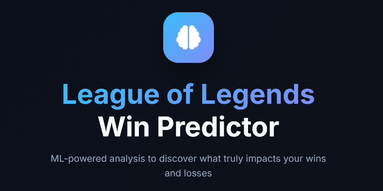

# Riot API Analyzer with Machine Learning Win Prediction

A sophisticated monorepo application designed to analyze League of Legends ranked matches using the Riot API. It leverages machine learning to identify personalized, skill-focused drivers of victory.

The system comprises a FastAPI backend, a Next.js frontend, and a Random Forest model for comprehensive performance analysis.



## Architecture

- **Backend**: FastAPI (Python 3.11+) - High-performance API layer utilizing SQLAlchemy and Scikit-learn.
- **Frontend**: Next.js 15+ (TypeScript) - Responsive user interface built with Tailwind CSS 4 and Recharts.
- **Database**: SQLite for local development and PostgreSQL for production environments.
- **Machine Learning Engine**: Random Forest model for feature importance analysis and win probability estimation.

## Key Features

- **Global Region Support**: Comprehensive support for EUW, NA, KR, BR, JP, and other major regions.
- **Riot ID Resolution**: Efficient lookup capability using the `Name#Tag` format.
- **Match Analysis**: Detailed performance breakdowns of recent ranked Solo/Duo matches.
- **Timeline Evaluation**: In-depth analysis of match momentum, including gold and experience differentials.
- **Performance Trends**: Longitudinal tracking of critical metrics such as Combat Efficiency, Forward Position, and Vision Score.
- **Strategic Insights**: Analytical categorization into Combat, Economy, Vision, Objectives, and Communication.

## Getting Started

### Prerequisites

- Python 3.11 or higher
- Node.js 18 or higher
- A valid Riot API Key (obtainable from the [Riot Developer Portal](https://developer.riotgames.com/))

### Deployment via Docker Compose

1. Configure the environment by creating a `dev.env` file in the root directory:
   ```env
   RIOT_API_KEY=your_key_here
   SECRET_KEY=your_secret_here
   PLATFORM_REGION=euw1
   REGIONAL_ROUTING=europe
   ```

2. Initialize the services:
   ```bash
   docker-compose up --build
   ```
   The application will be accessible at [http://localhost:3000](http://localhost:3000).

### Manual Configuration

#### Backend (API)
Navigate to the API directory and install the necessary dependencies:
```bash
cd apps/api
# It is recommended to use a virtual environment
pip install -r pyproject.toml
uvicorn main:app --reload
```

#### Frontend (Web)
Navigate to the web directory to install dependencies and start the development server:
```bash
cd apps/web
npm install
npm run dev
```

## Deployment via Railway

This project is structured as a monorepo, which requires the creation of two separate services on Railway: one for the backend API and one for the frontend web interface.

### 1. API Service Configuration
1. Create a new service in your Railway project sourced from your GitHub repository.
2. In the service **Settings**, navigate to the **General** section and set the **Root Directory** to `apps/api`.
3. Configure the following **Variables**:
   - `RIOT_API_KEY`: Your Riot Developer API key.
   - `SECRET_KEY`: A secure random string for session integrity.
   - `PLATFORM_REGION`: The target platform (e.g., `euw1`).
   - `REGIONAL_ROUTING`: The regional routing group (e.g., `europe`).
   - `DATABASE_URL`: `sqlite+aiosqlite:///status.db` (or your production database URL).

### 2. Web Service Configuration
1. Create a second service from the same GitHub repository.
2. In the service **Settings**, set the **Root Directory** to `apps/web`.
3. Configure the following **Variables**:
   - `NEXT_PUBLIC_API_URL`: The public URL of your API service (e.g., `https://your-api-service.up.railway.app/api`).

### Continuous Deployment
The repository includes service-specific `railway.json` files. Railway will automatically detect changes and trigger a redeployment for the corresponding service whenever updates are pushed to the repository.

## Project Structure

- `apps/api`: Contains the FastAPI backend, machine learning models, and data processing services.
- `apps/web`: Contains the Next.js frontend and UI component library.
- `infra`: Infrastructure-as-code and deployment configuration files.

## Technical Considerations

- **Player Agency**: The machine learning model deliberately excludes direct win-condition features (e.g., total structure kills) to focus on metrics within a player's direct control.
- **API Constraints**: Standard Riot API rate limits apply. Ensure your API key is correctly configured and active.

## License

This project is licensed under the MIT License.
