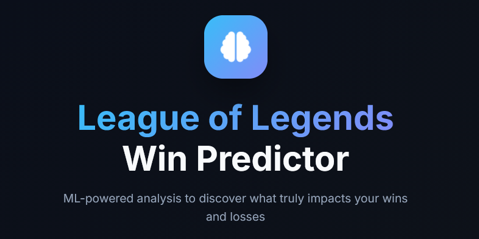
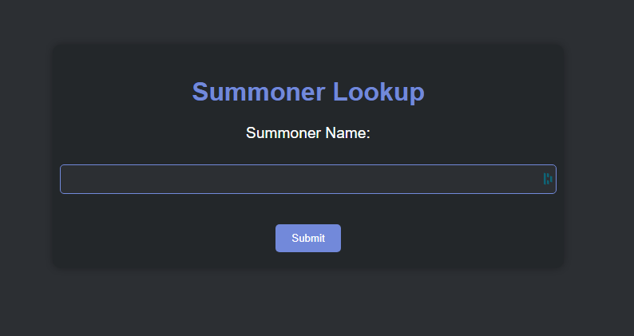
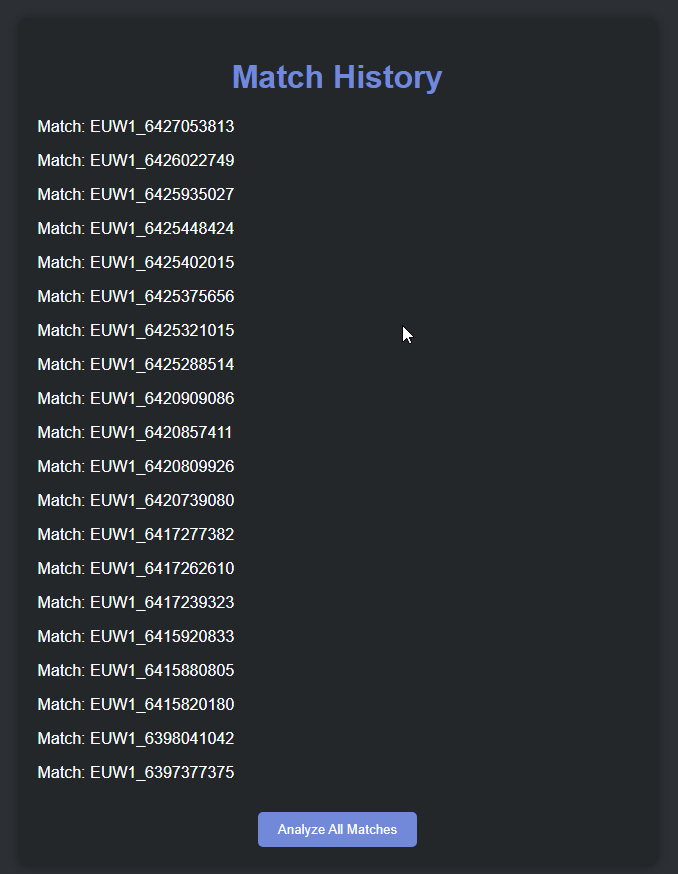
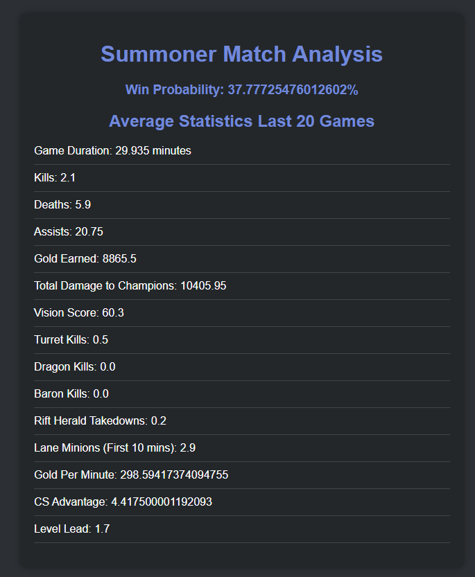
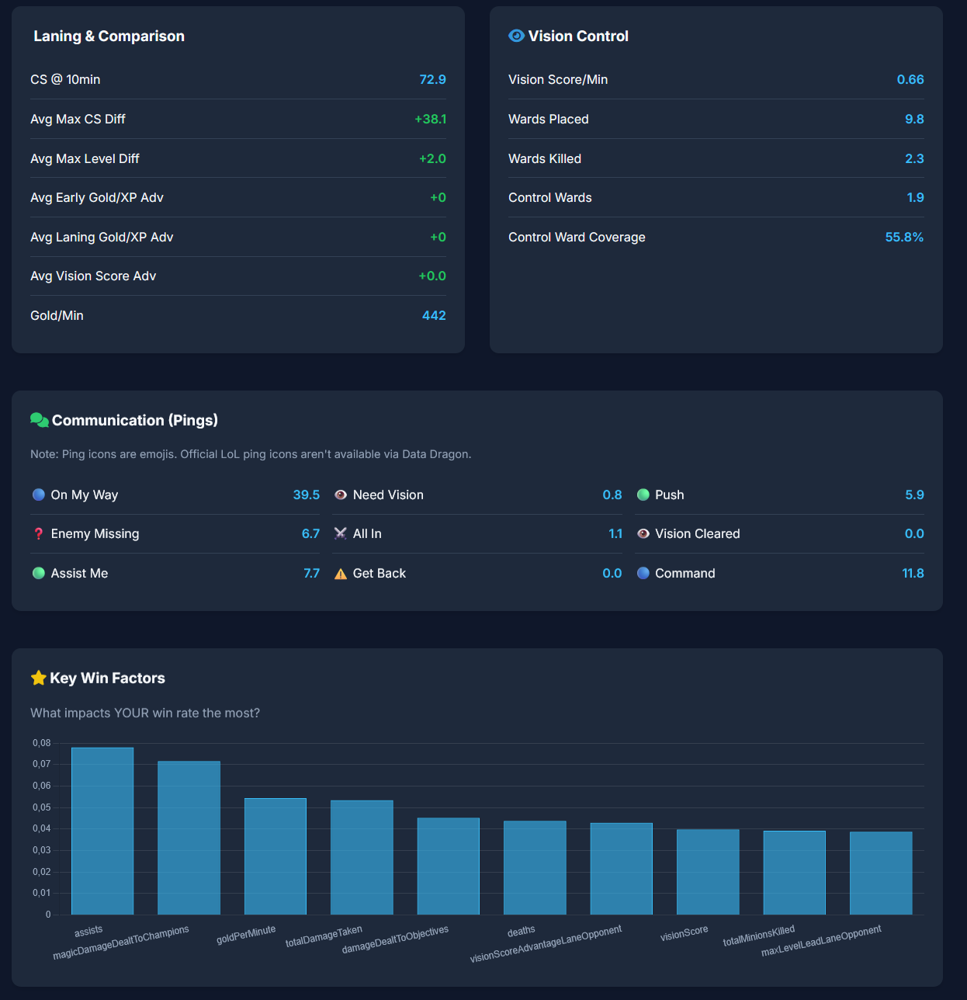

# Flask Riot API Analyzer with ML Win Prediction



## ✨ New Features

- **🌍 Global Region Support**: Select from 11 regions (EUW, NA, KR, BR, JP, and more!)
- **🎨 Modern, Beautiful UI**: Complete redesign with animations and smooth interactions
- **📱 Fully Responsive**: Works perfectly on desktop, tablet, and mobile
- **✨ Smooth Animations**: Professional entrance effects, hover interactions, and scroll reveals
- **💫 Enhanced Charts**: Beautiful, interactive data visualizations

## Features

- **🌍 Region Selection**: Works with all major Riot servers worldwide
  - Europe: EUW, EUNE, TR, RU
  - Americas: NA, BR, LAN, LAS
  - Asia-Pacific: KR, JP, OCE
  
- **Riot ID Lookup**: Search for any summoner by their Riot ID (Name#Tag)
- **Match History Analysis**: Analyzes your last 20 ranked solo/duo matches
- **ML-Powered Insights**: Uses Random Forest Classifier to identify what truly matters for your wins
- **Actionable Metrics**: Focuses on skill-based metrics rather than direct win conditions
- **Category Analysis**: Groups insights into Combat, Economy, Vision, Objectives, and Communication
- **Performance Comparison**: Shows how your stats differ between wins and losses
- **Modern UI**: Beautiful, animated interface with smooth interactions

## Screenshots






## What Makes This Analyzer Different

Unlike basic stat trackers, this analyzer:
- **Removes causal features** like tower kills (which are direct win conditions)
- **Focuses on player agency** - metrics you can actually improve
- **Provides personalized insights** - what works for YOU based on YOUR matches
- **Shows win/loss differences** - understand what you do differently when winning

## Prerequisites

- Python 3.11+ installed on your system
- Riot API key (Get it from the [Riot Developer Portal](https://developer.riotgames.com/))

## Local Installation

1. Clone the repository:
   ```bash
   git clone <your-repo-url>
   cd Riot-API-Python-Flask-App-Win-Prediction-Stats
   ```

2. Install the required Python packages:
   ```bash
   pip install -r requirements.txt
   ```

3. Create a `.env` file in the root directory with your API keys:
   ```
   RIOT_API_KEY=your_riot_api_key_here
   SECRET_KEY=your_secret_key_here
   PLATFORM_REGION=euw1
   REGIONAL_ROUTING=europe
   ```

4. Run the application:
   ```bash
   python app.py
   ```

5. Open your web browser and visit `http://localhost:5000`

## Deploying to Railway

Railway is a modern platform that makes deploying web applications easy. Follow these steps:

### Step 1: Prepare Your Repository

1. Make sure all your changes are committed to git:
   ```bash
   git add .
   git commit -m "Prepare for Railway deployment"
   git push origin master
   ```

### Step 2: Create a Railway Account

1. Go to [Railway.app](https://railway.app/)
2. Sign up using GitHub (recommended for easier deployment)

### Step 3: Deploy from GitHub

1. Click "New Project" in Railway dashboard
2. Select "Deploy from GitHub repo"
3. Choose your repository: `Riot-API-Python-Flask-App-Win-Prediction-Stats`
4. Railway will automatically detect the configuration from `railway.json`

### Step 4: Configure Environment Variables

1. In your Railway project, click on your service
2. Go to the "Variables" tab
3. Add the following environment variables:
   - `RIOT_API_KEY`: Your Riot API key from developer portal
   - `SECRET_KEY`: A random secret key for Flask sessions (generate one with `python -c "import secrets; print(secrets.token_hex(32))"`)
   - `PLATFORM_REGION`: Your platform region (e.g., `euw1`, `na1`, `kr`)
   - `REGIONAL_ROUTING`: Your regional routing (e.g., `europe`, `americas`, `asia`)

### Step 5: Deploy

1. Railway will automatically build and deploy your application
2. Once deployed, Railway will provide you with a public URL (e.g., `https://your-app.railway.app`)
3. Visit the URL to access your deployed application!

### Monitoring Your Deployment

- **Logs**: Check the "Deployments" tab to view application logs
- **Metrics**: Monitor CPU, memory, and network usage in the "Metrics" tab
- **Redeploy**: Push changes to GitHub and Railway will automatically redeploy

### Important Notes for Railway Deployment

- Railway provides 500 hours of free usage per month (sufficient for personal projects)
- Your app will sleep after 5 minutes of inactivity (first request might be slower)
- Keep your Riot API key secure - never commit it to git
- Railway uses Nixpacks to automatically detect and build your Python application

## Region Configuration

Update your `.env` file or Railway environment variables based on your region:

**Platform Regions** (PLATFORM_REGION):
- `euw1` - Europe West
- `eun1` - Europe Nordic & East
- `na1` - North America
- `kr` - Korea
- `br1` - Brazil
- `la1` - Latin America North
- `la2` - Latin America South
- `oc1` - Oceania
- `tr1` - Turkey
- `ru` - Russia
- `jp1` - Japan

**Regional Routing** (REGIONAL_ROUTING):
- `europe` - For EUW, EUNE, TR, RU
- `americas` - For NA, BR, LAN, LAS
- `asia` - For KR, JP
- `sea` - For OCE, PH, SG, TH, TW, VN

## How It Works

### Data Collection
1. Enter a Riot ID (Name#Tag) on the home page
2. Application fetches the last 20 ranked solo/duo matches
3. Extracts detailed performance metrics from each match

### ML Analysis
The Random Forest model analyzes your performance across multiple dimensions:

- **Combat & KDA**: Kill participation, damage output, survivability
- **Economy & Farming**: CS per minute, gold efficiency
- **Early Game**: Laning phase advantages, level leads
- **Vision Control**: Ward placement, vision score, map awareness
- **Objective Control**: Dragon/Baron participation (fighting for objectives, not just results)
- **Communication**: Ping usage patterns

### Key Innovations

1. **No Causal Features**: Removed tower kills/damage as these are win conditions, not predictors
2. **Win vs Loss Comparison**: Shows exactly what you do differently in wins vs losses
3. **Category Importance**: Identifies which aspect of gameplay matters most for YOU
4. **Personalized Insights**: Based on your actual match data, not generic statistics

## API Rate Limits

Be aware of Riot API rate limits:
- Development API Key: 20 requests per second, 100 requests per 2 minutes
- If you exceed limits, you'll need to wait or apply for a production API key

## Troubleshooting

### Common Issues

**"API Error 403"**: Your API key is invalid or expired. Get a new one from the developer portal.

**"API Error 429"**: You've hit the rate limit. Wait a few minutes and try again.

**"Not enough data to train model"**: The summoner needs at least 5 ranked solo/duo matches.

**Railway deployment fails**: Check the logs in Railway dashboard. Common issues:
- Missing environment variables
- Invalid Python version in `runtime.txt`
- Dependencies not in `requirements.txt`

## Contributing

Feel free to open issues or submit pull requests to improve the analyzer!

## License

This project is licensed under the [MIT License](LICENSE).

## Acknowledgments

- Riot Games for providing the League of Legends API
- scikit-learn for the machine learning capabilities
- Railway for easy deployment platform
